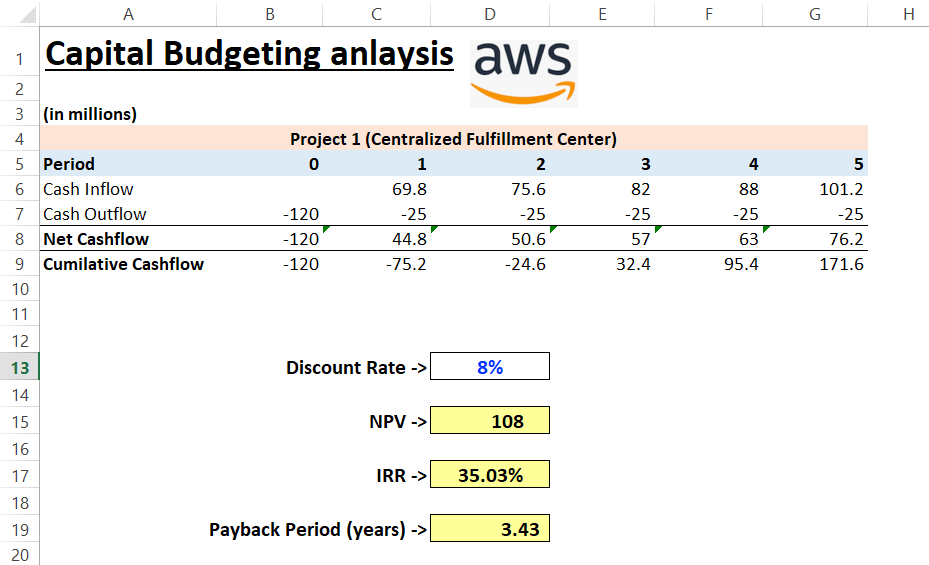

## Model Preview

This model evaluates two Nike investment projects, with Project 1 being significantly larger in scale than Project 2. Both projects are assessed using NPV, IRR, and Payback Period to determine financial viability and potential value creation. It includes projected cash flows, discount rate assumptions, and a comparative analysis of project outcomes. Designed to illustrate decision-making in multi-project capital budgeting scenarios.

Note: This folder also includes a practice example file built with imaginary figures, which served as a template and framework reference before the actual report was created.

Capital Budgeting - Amazon Warehouse Projects
Model: Capital Budgeting Analysis (NPV, IRR, Payback Period)
Company: Amazon - Fulfillment Center vs. Micro-Warehouse Hub

Evaluated two competing Amazon warehouse investment proposals using NPV, IRR, and Payback Period at an 8% discount rate. Both projects showed strong return profiles; the larger Fulfillment Center was recommended based on significantly higher NPV despite similar IRR.

Key Outputs:

Discount Rate: 8%
Fulfillment Center: NPV ~$108M, IRR ~35%
Micro-Warehouse Hub: NPV ~$46M, IRR ~34%
Recommendation: Fulfillment Center (higher NPV)
