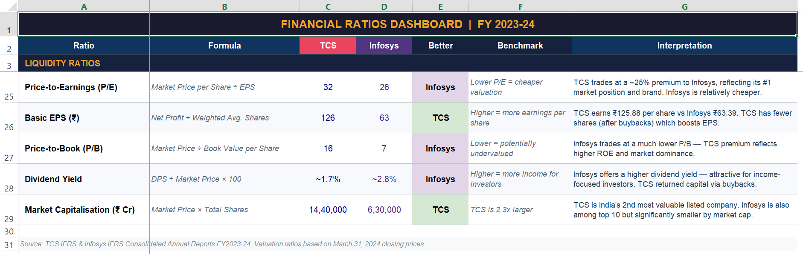

## Model Preview

Comparative equity research report analyzing TCS vs Infosys across 20+ financial ratios - covering profitability, liquidity, solvency, efficiency, and valuation metrics, with investment recommendations. Data sourced from IFRS Consolidated Annual Reports FY2023-24.

Equity Research Report - TCS vs Infosys
Model: Comparative Equity Research & Financial Ratio Analysis
Companies: Tata Consultancy Services (TCS) vs Infosys Limited
Data: IFRS Consolidated Annual Reports — FY 2023-24

Built a full equity research report comparing India's two largest IT companies across 20+ financial ratios and key performance metrics. Covers common-size income statement analysis, balance sheet comparison, and a complete ratio dashboard spanning liquidity, profitability, efficiency, solvency, and valuation. Includes a head-to-head scorecard across 17 metrics and data-backed investment recommendations for both companies.

Key Outputs:

Ratios Covered: Current, Quick, Cash, Net Margin, ROE, ROA, ROCE, Debt/Equity, Interest Coverage, Asset Turnover, Debtor Days, P/E, P/B, EPS, Dividend Yield
Scorecard: TCS wins 12/17 metrics; Infosys wins on valuation & dividend yield
Recommendation 1: Accumulate TCS for long-term quality compounding
Recommendation 2: Buy Infosys for value + dividend income
Tools: Excel (Financial Modeling) + Python (openpyxl) + AI-assisted structuring
AI Disclosure: AI tools were used to assist with data organisation and formatting. All financial figures are sourced directly from official annual reports. Analysis and recommendations represent the author's own judgement.

